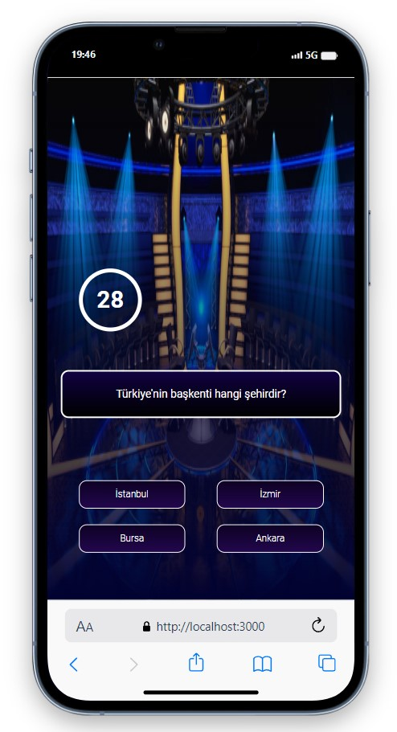

# Milyoner App

<div align="center">
  
</div>

## About the Project

This project contains a trivia game application where users progress by answering questions from various categories and earn rewards. The project is developed using the React library.

## Table of Contents

- [Technologies Used](#technologies-used)
- [Usage](#useage)
- [Project Skeleton](#project-skeleton)
- [Screenshots](#screenshots)

## Live Demo

[Milyoner App]()

## Technologies Used

- React
- [useSound](https://www.npmjs.com/package/use-sound) for sounds
- Styling with CSS

## Usage

- Start by entering your username.
- Answer the questions to progress.
- Earn rewards for each correct answer.
- There are a total of 13 questions, and the reward amount increases with each question.
- You can end the game by answering the questions incorrectly.
- If you answer the last question correctly, you win the game.

## Project Skeleton

```
Milyoner App (folder)
|
|----readme.md         
SOLUTION
├── public
│    └── index.html
├── src
│    ├── assets
│    │     ├── [images]
│    │     └── [sounds]
│    ├── components
│    │     ├── Pyramid.jsx
│    │     ├── Start.jsx          
│    │     ├── Timer.jsx          
│    │     └── Trivia.jsx 
│    ├── helpers
│    │     ├── data.js        
│    │     └── moneyPyramid.js   
│    ├── pages   
│    │     └── Home.jsx 
│    ├── App.js
│    ├── index.css
│    └── index.js
├── package.json
└── yarn.lock
```

## Screenshots

<div align="center">
  
  
  
</div>

## Compatibility

The project is compatible with both wide-screen computers and mobile devices.